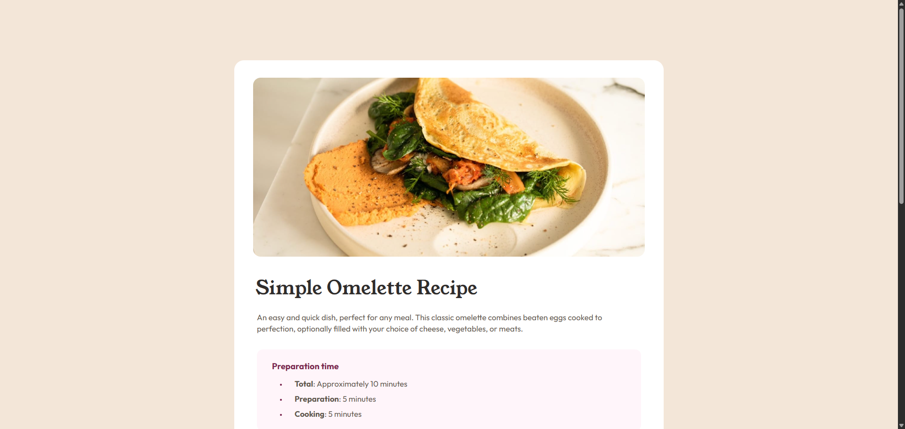

# Frontend Mentor - Recipe page solution

This is a solution to the [Recipe page challenge on Frontend Mentor](https://www.frontendmentor.io/challenges/recipe-page-KiTsR8QQKm). Frontend Mentor challenges help you improve your coding skills by building realistic projects. 

## Table of contents

- [Overview](#overview)
  - [The challenge](#the-challenge)
  - [Screenshot](#screenshot)
  - [Links](#links)
- [My process](#my-process)
  - [Built with](#built-with)
  - [What I learned](#what-i-learned)
  - [Continued development](#continued-development)
  - [Useful resources](#useful-resources)
- [Author](#author)
- [Acknowledgments](#acknowledgments)

## Overview

### Screenshot



### Links

- Solution URL: [Github Repo](https://github.com/danielMut02/recipe-omelette)
- Live Site URL: [Github page](https://danielmut02.github.io/recipe-omelette/)
## My process

### Built with

- Semantic HTML5 markup
- CSS custom properties
- Flexbox
- Mobile-first workflow

### What I learned

Still working on HTML semantics and CSS classes creation

Tried to implement some SEO techniques to make the website more discoverable.

```html
  <meta name="author" content="Daniel Mut Torres">
  <meta name="description" content="Quick omelette recipe page">
  <meta name="robots" content="index, follow" />
  <link rel="canonical" href="ADD_SITE_LINK_HERE" />
```

In the CSS learned how to style the dots in unordered and ordered lists. Also, I tried to be more organized when styling the different classes.

```css
.ingredients__list-item::marker{
    font-size: 0.7em;
}
```

### Continued development

In current projects I want to target Grid properties to continue enhancing my responsiveness abilities. Also, is my goal to develop projects including JavaScript, in order to make my websites more interactive. Later on, I will dive into JS frameworks and libraries such as ReactJS.

### Useful resources

- [DevDocs](https://devdocs.io/) - This is an amazing technical documentation site. It helped clarify some doubts I had on flex and responsiveness
- [w3schools](https://www.w3schools.com/) - This site helped with some code examples about making images responsive. Great when you don't know how to implement certain feature.

## Author

- Frontend Mentor - [@danielMut02](https://www.frontendmentor.io/profile/danielMut02)
- GitHub - [@danielMut02](https://github.com/danielMut02)

## Acknowledgments

Eternally thankful to freeCodeCamp since they served me as guidance for the web development career I am pursuing. Through their guided course for web developers I found a new passion! Also, my gratitude goes to Front End mentor for helping and creating such a wonderful platform to learn.
